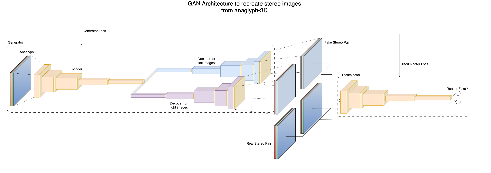
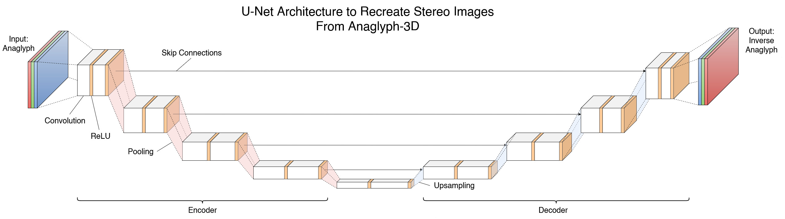

# Recreation of stereo images from 3D-Anaglyphs using Deep Learning

This repository follows the idea to recreate stereo images from 3D-Anaglyphs using Deep Learning. The main goal is to create a model that can re-generate stereo images from 3D-Anaglyphs.

The following approaches have been /will be implemented:

## GAN (Generative Adversarial Network) Architecture

The GAN architecture is a generative model that consists of two networks: a generator and a discriminator. The generator is responsible for generating new data instances, while the discriminator is responsible for distinguishing between real and generated data instances. The generator and discriminator are trained simultaneously, with the generator trying to fool the discriminator and the discriminator trying to distinguish between real and generated data instances.

## U-Net Architecture

The U-Net architecture is a convolutional neural network that is mainly used for image segmentation. It consists of an encoder and a decoder, with skip connections between the encoder and decoder. The encoder is responsible for extracting features from the input image, while the decoder is responsible for generating the output image. The skip connections help to preserve spatial information during the upsampling process.  
By transforming the image segmentation task into a pixel-wise classification task, the U-Net architecture can be used to generate inverse ana-glyphs from 3D-Anaglyphs, which can be used to recreate the final stereo images.

