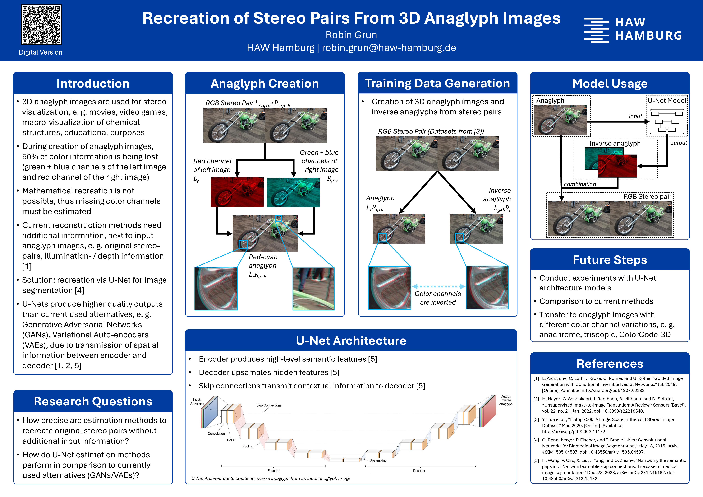

# Docs

> This directory contains images and other files used in the README.md file, as well as a scientific one-pager of the project.

## Scientific One-Pager
<figure>
    
    <figcaption>See the full sized One-Pager <a href="Poster_Recreation_of_Anaglyph_Images.pdf">here :link: </a></figcaption>
</figure>