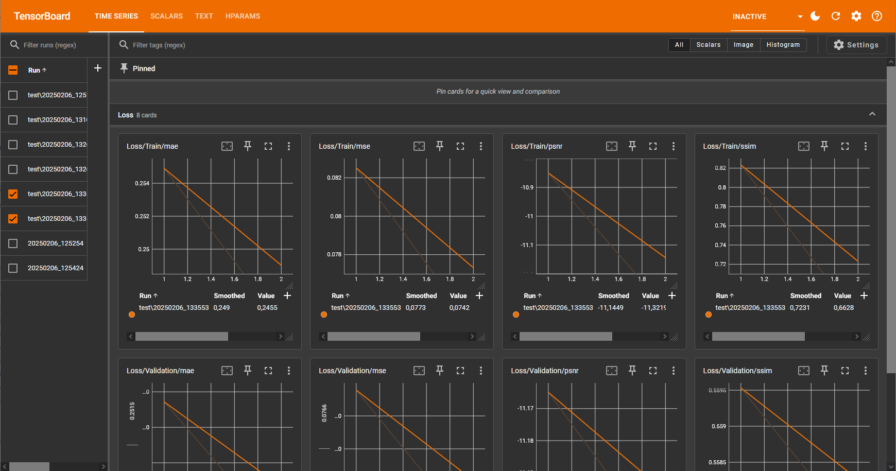
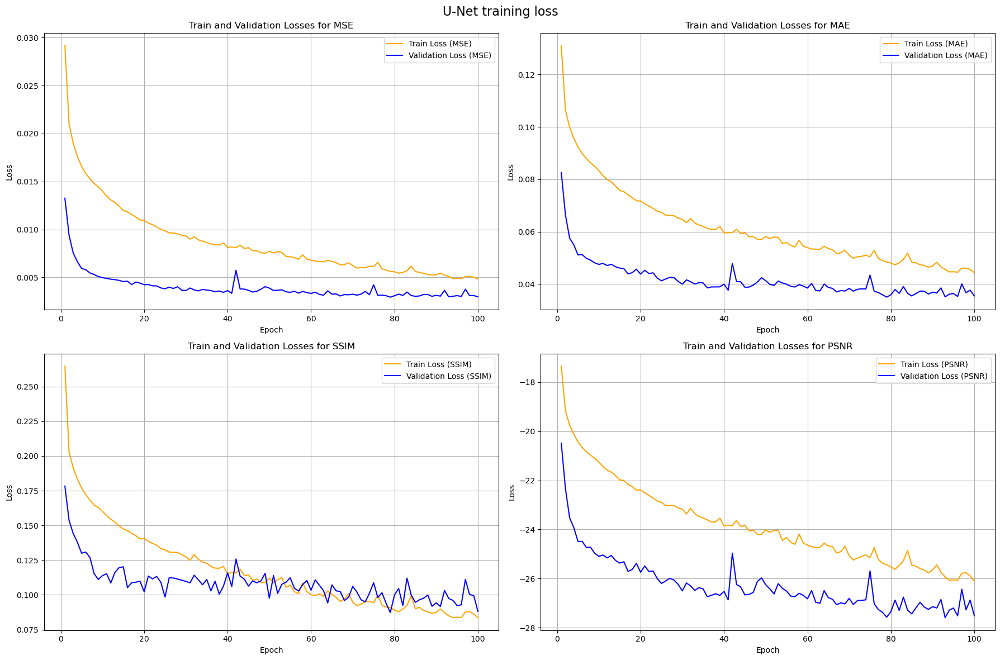
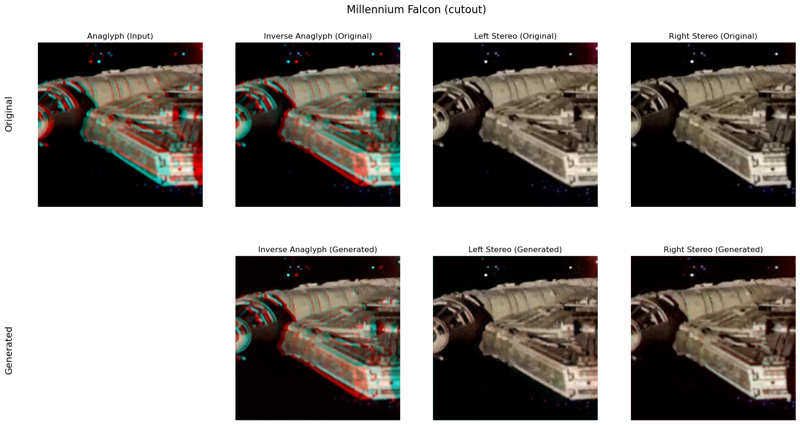
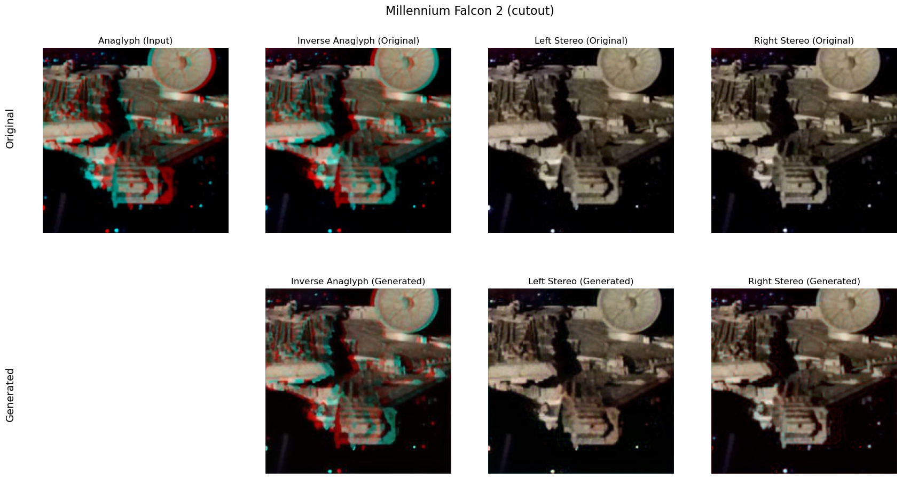

> **_NOTE :_** This directory contains code to create, train, test and infer models for anaglyph recreation.

# Installation

_Depending on your OS, the installation steps may vary.<br>
On Windows, using anaconda is recommended. On Linux, using pip is sufficient.<br>
Make sure to run the installation steps from the `image_colorization/` directory_

## Windows

- Create a python environment with anaconda and name `anaconda-gan` <br>
  `conda create --name anaglyph-gan python=3.11`
- Install torch, torchaudio, torchvision, cuda support https://pytorch.org/get-started/locally/ <br>
  `conda install pytorch torchvision torchaudio pytorch-cuda=12.4 -c pytorch -c nvidia --yes`
- Install conda requirements from `requirements_conda.txt` <br>
  `conda install --yes --file requirements_conda.txt`
- Install pip requirements from `requirements_pip.txt` <br>
  `pip install -r requirements_pip.txt`
- Add python kernel to notebook <br>
  `python -m ipykernel install --name=anaglyph-gan`
- Add the image_colorization directory to the python path <br>
  `setx PYTHONPATH %PYTHONPATH%;<full path to this directory>`

## Linux

- Install torch, torchaudio, torchvision, cuda support https://pytorch.org/get-started/locally/ <br>
  `pip install torch torchvision torchaudio`
- Install requirements from `requirements_conda.txt` and `requirements_pip.txt` <br>
  `pip install -r requirements_conda.txt && pip install -r requirements_pip.txt`
- Add the image_colorization directory to the python path <br>
  `echo "export PYTHONPATH=$PYTHONPATH:($pwd)" >> ~/.bashrc`

---

# Usage

_Note: the following commands are displayed for U-Net model as it is the current model under active development. For GAN
model, replace `unet` with `gan` in the commands._

## Run in Docker container [optional]

Running the scripts is optional, but a dockerfile is provided. Run all steps from the root directory of the project
`/stereo-recreation-from-anaglyphs`.

For detailed instructions, see the [Docker Readme](../docker/README.md).

## Training

During training, the progress and loss values will be displayed in the console as well as in tensorboard.
Open tensorboard with `tensorboard --logdir=logs` (When run from the `image_colorization/` directory) and navigate to
`http://localhost:6006/` in your browser.

### In Jupyter Notebook

- Open `recreate_anaglyphs_unet.ipynb` for U-Net training in Jupyter Notebook
- Configuration parameters are used from `config_notebook.py` (or `config_notebook_test_run.py` for test run)

### In Terminal

- Run `python src/run_trainung_unet.py [--test_run]` for U-Net training in terminal <br>
  The `--test_run` flag is optional and is used to run a test training with a small dataset to verify everything is
  working as expected.
- Configuration parameters are used from `src/config.py` (or `src/config_test_run.py` for test run)

## Visualizing metrics

### TensorBoard

During and post-training, the training progress is being visualized in a tensorboard.

- Open tensorboard with `tensorboard --logdir=logs` (When run from the `image_colorization/` directory) in the CLI and
  navigate to `http://localhost:6006/` in your browser.

<figure>
    
    <figcaption>TensorBoard Screenshot</figcaption>
</figure>

### Custom visualizations


- The directory `visualizations/` contains scripts to visualize training metrics in Jupyter Notebook.
- `visualizations/plot_training_results_unet.ipynb` visualizes metrics for the U-Net in Jupyter Notebook. Make sure to
  select the corresponding `.csv` file in the notebook to display its contents
<figure>
    
    <figcaption>Training losses of the U-Net model</figcaption>
</figure>

- `visualizations/create_presentation_images.ipynb` visualizes example test images in Jupyter notebook.
<figure>
    
    
    <figcaption>Example outputs</figcaption>
</figure>

- `visualizations/test_model.ipynb` tests the model and displays testing metrics
<figure>
    
    <figcaption>Losses of the U-Net model from a test run</figcaption>
</figure>

## Testing/Inference

Interference is currently only supported for U-Net. GAN interference is not yet implemented.

### In Jupyter Notebook

Notebooks are contained in the `infer/` directory

- Open `infer/infer_unet.ipynb` for U-Net inference in Jupyter Notebook

### In Terminal

This command will process the input anaglyph image using the specified U-Net model, save the reversed anaglyph image,
and create a stereo pair image with the specified dimensions.

To run the infer_unet.py script, use the following command:<br>
```bash
python image_colorization/src/infer_model.py --model_path <model_path> --image_path <image_path> --output_path <output_path> --stereo_output_path <stereo_output_path> [--img_height <img_height>] [--img_width <img_width>] [--output_height <output_height>] [--output_width <output_width>]
```

Arguments:<br>

- `--model_path` (required): Path to the U-Net model.
- `--image_path` (required): Path to the input anaglyph image.
- `--output_path` (required): Path to save the reversed anaglyph image.
- `--stereo_output_path` (required): Path to save the stereo pair image.
- `--model_input_height` (optional): Height of the input of the model. Input image will be transformed to this value.
  Default is 256.
- `--model_input_width` (optional): Width of the input of the model. Input image will be transformed to this value
  Default is 256.
- `--output_height`(optional): Height of the output reversed anaglyph image and stereo-pair. Default is 256.
- `--output_width` (optional): Width of the output reversed anaglyph image. The stereo-pair's width is
  `2 * output_width`. Default is 256.

Example:<br>
```bash
  python image_colorization/src/infer_model.py --model_path path/to/unet_checkpoint.pth --image_path path/to/anaglyph_image.png --output_path path/to/output_image.png --stereo_output_path path/to/stereo_pair.png --model_input_height 256 --model_input_width 256 --output_height 256 --output_width 256
```

```
                                      _.....__
                             (.--...._`'--._
                   _,...----''''`-.._ `-..__`.._
          __.--'-;..-------'''''`._')      `--.-.__
        '-------------------------------------------'
        \ '----------------  ,-.  .-------------'. |
         \`.              ,','  \ \             ,' /
          \ \             / /   `.`.          ,' ,'
          `. `.__________/,'     `.' .......-' ,'
            `............-'        "---------''

            ______     _____ _
            | ___ \   /  ___| |
            | |_/ /___\ `--.| |_ ___ _ __ ___  ___
            |    // _ \`--. \ __/ _ \ '__/ _ \/ _ \
            | |\ \  __/\__/ / ||  __/ | |  __/ (_) |
            \_| \_\___\____/ \__\___|_|  \___|\___/

        --- Recreate Stereo Images from its Anaglyph! ---

Reversed anaglyph saved at [...]
Stereo pair saved at [...]
```